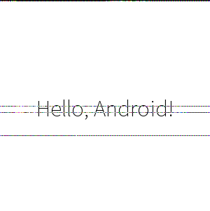
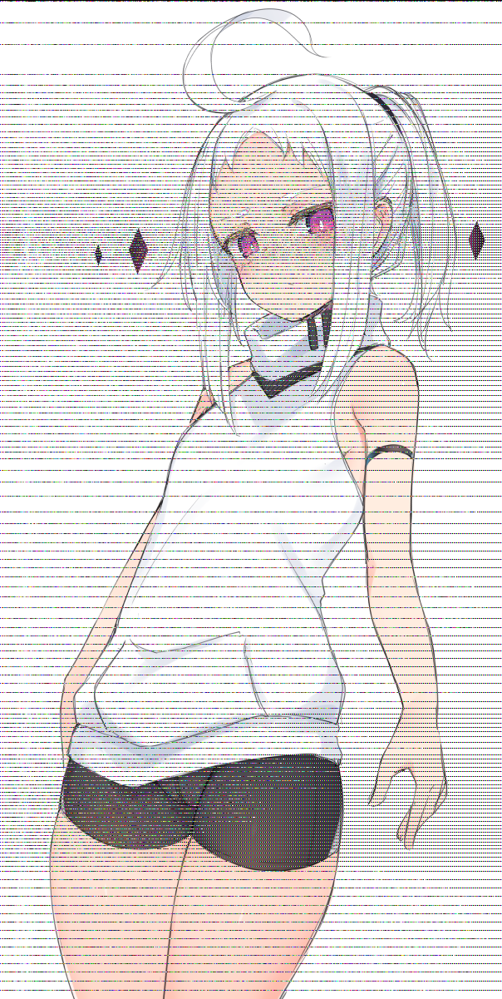

# macos_shadow_tank
- Shadow Tank PNG Based on MacOS PNG Decoder with iDOT processor.
- **经过一番调查发现新版的 MacOS 已经不再支持这种 PNG 交错了，感觉被扫进了历史的垃圾堆，可惜**

## 特别鸣谢

- 感谢 `cppascalinux` 大佬分析出了 PNG 交错的基本实现思路
- 感谢 `HocRiser` 大佬协助测试 `MacOS` 上的显示效果（`Mojave 10.14.6`）
- 似乎 `iOS` 修改了它的图片解压算法，所以现在可能在 `iOS` 端看不到指定效果了

## 图片示例

- 下图 `sample.png`，在 `MacOS` 平台会观察到文字 `Hello, Apple!`
- 在其他平台上，会观察到文字 `Hello, Android!`

## 灵感来源

- 这个算法并不是我们首创的，由于我们在网上收集到过以下图片，详见 `img` 文件夹下的 `p1.png`,  `p2.png`,  `p3.png`
- 以下图片在 `MacOS` 上能够观察到该图片裸体的版本，其他平台能看到穿衣服的版本

- 由于我们并没有 Google 到相关的开源实现或博客，因此我们独立完成了该算法的分析与实现，并进行了代码开源

## 前置条件

- 在 `ubuntu22.04` 下进行测试，其他 `linux` 相关平台自行负责
- 安装 `python3` 
- 安装 `python3` 模块 `pillow` 以及 `tqdm`
- 一般来说都有：有 `zlib` 库，`g++` 和 `make`

## 使用方法

- 源代码写得很乱，最近懒得重构了
- 运行 `merge_png.py` 可以将 `sample` 目录中的 `macos.png` 和 `android.png` 合并为 `merged.png`
- 即使你没有 2018 年以前的 macOS，你也可以运行 `preview_macos.py` 将 `sample` 目录中的 `merged.png` 拆分得到 `macos_slice.png` ，即为混合图像在老版本 macOS 下的解码效果图

## 算法设置

- 默认在一个 “数据对” 中会压缩尽可能多的行
- 如果要求数据对中必须只能压缩两行内容（乱码线会很密集）可以在 `src/gen_idats_new.cpp` 中 `#define STEP_EQUALS_TWO`

## 参考文献

- PNG 文件格式
  - https://en.wikipedia.org/wiki/PNG#File_format
  - http://www.libpng.org/pub/png/spec/1.2/PNG-Contents.html
- iDOT 块的结构
  - https://www.hackerfactor.com/blog/index.php?/archives/895-Connecting-the-iDOTs.html
- PNG Chunk 结构
  - http://www.libpng.org/pub/png/spec/1.2/PNG-Chunks.html#C.IDAT
- RFC1951 与 RFC1950：zlib 文件结构
  - https://datatracker.ietf.org/doc/html/rfc1951
  - https://www.ietf.org/rfc/rfc1950.txt

